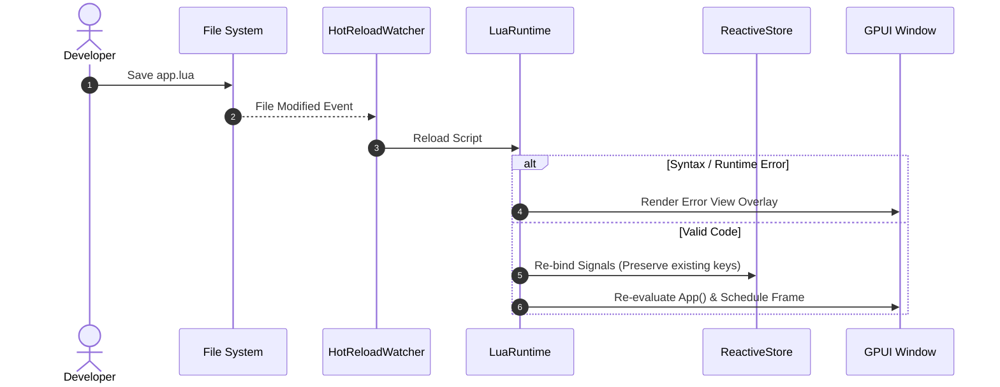

# Hot Reloading

GPUI.lua includes an intelligent file system watcher and hot-reloading pipeline that instantly refreshes your UI whenever source files are saved.

## How Hot Reloading Works

1. The file watcher monitors the entrypoint script directory and all imported Lua modules.
2. Upon file modification, the script is parsed in an isolated sandbox.
3. If syntax or runtime errors occur, an interactive **Error View overlay** is rendered on the GPUI canvas displaying the exact line number, error message, and stack trace without crashing the application.
4. When the code is error-free, the new UI tree is mounted, while reactive state stored in `signal()` keys is preserved intact.



## Configuring Hot Reloading

Hot reloading is enabled by default in debug builds (`cfg!(debug_assertions)`) and disabled in `--release` builds:

```rust
use gpui_lua::LuaApp;

fn main() -> anyhow::Result<()> {
    LuaApp::new("ui/app.lua")?
        .with_hot_reload(true) // Explicitly enable or disable
        .run()
}
```

## Error View Overlay

When a Lua syntax error occurs during development:
- The screen displays a dark overlay card with red borders.
- The Lua stack trace and error message are presented with copy-to-clipboard functionality.
- As soon as you correct the typo in your editor and save, the error view disappears immediately and your application resumes state without needing a manual restart.
